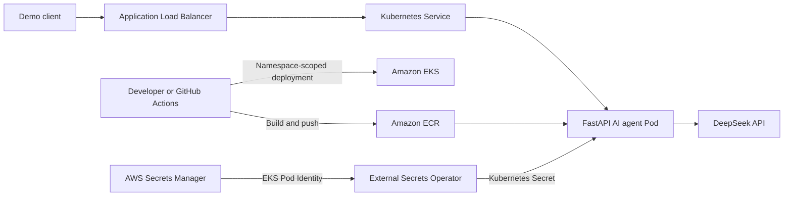

# AWS EKS Platform for AI Agent Sample

This repository provisions an Amazon EKS platform for the
[`AiAgentSample`](https://github.com/GodfreyLyu/AiAgentSample) FastAPI service. It is designed
as a working development environment and as a portfolio project that demonstrates networking,
Kubernetes, container delivery, workload identity, secret management, and CI/CD on AWS.

The default environment is deployed to `ap-northeast-1` and uses Kubernetes `1.35`.



## What Terraform creates

- A VPC spanning two Availability Zones, with public and private subnets, an Internet Gateway,
  and one NAT Gateway.
- An EKS cluster with a managed node group in the private subnets. The default node group runs
  two `t3.small` Amazon Linux 2023 nodes and can scale from two to four nodes.
- EKS control-plane logging for API, audit, authenticator, controller manager, and scheduler
  events, retained in CloudWatch Logs for 30 days.
- The CoreDNS, kube-proxy, VPC CNI, and EKS Pod Identity Agent add-ons. VPC CNI prefix delegation
  and Kubernetes network policy support are enabled.
- A private ECR repository with immutable tags, scan-on-push, and lifecycle rules for old images.
- AWS Load Balancer Controller, installed with Helm and authorized through EKS Pod Identity.
- External Secrets Operator, installed with Helm and authorized to read only this application's
  Secrets Manager secret.
- An application namespace with the Kubernetes `restricted` Pod Security Standard enforced.
- An optional GitHub Actions OIDC role that can push images to this ECR repository and administer
  resources only within the application namespace.

Terraform creates the Secrets Manager secret resource, but deliberately does not create a secret
value. The DeepSeek API key and application bearer token therefore do not enter Terraform state,
plan output, or Git history.

## Repository layout

```text
infrastructure/
├── bootstrap/backend/       # S3 remote-state bucket
├── environments/dev/        # Development environment and platform add-ons
└── modules/
    ├── ecr/                  # Application image repository
    ├── eks/                  # EKS cluster and managed node group
    └── vpc/                  # Two-AZ network
```

## Prerequisites

- Terraform `>= 1.10, < 2.0`
- AWS CLI authenticated to an account with permission to create the documented resources
- `kubectl`
- Docker with `linux/amd64` build support
- `jq` and `curl` for the optional GitHub OIDC setup commands

Helm does not need to be installed locally. Terraform uses the Helm provider to install the
cluster add-ons.

## 1. Create the remote-state bucket

Run the bootstrap configuration once:

```bash
cd infrastructure/bootstrap/backend
terraform init
terraform plan
terraform apply
```

The default bootstrap configuration creates `aws-eks-platform-terraform-state`, matching
`infrastructure/environments/dev/backend.tf`. S3 bucket names are globally unique. If the default
name is unavailable, choose another `project_name` during bootstrap and update the backend bucket
name before initializing the development environment.

## 2. Configure the development environment

```bash
cd infrastructure/environments/dev
cp terraform.tfvars.example terraform.tfvars
```

Replace the documentation-only CIDR in `terraform.tfvars` with the public IP address from which
Terraform, AWS CLI, and `kubectl` will access the EKS API, for example `198.51.100.20/32`.
Although the module default is `0.0.0.0/0` for compatibility with the existing learning setup,
leaving the Kubernetes API open to every source is not recommended.

Review the node type, capacity type, Kubernetes version, region, and secret recovery window before
applying. The default is zero days for `dev`, so a destroy followed by an immediate apply can
recreate the fixed secret name, and 30 days for `staging` or `prod`. Set
`application_secret_recovery_window_in_days` explicitly when a different deletion policy is
required.

```bash
terraform init
terraform fmt -check -recursive ../..
terraform validate
terraform plan
terraform apply
```

Configure `kubectl`:

```bash
aws eks update-kubeconfig \
  --name "$(terraform output -raw eks_cluster_name)" \
  --region ap-northeast-1
```

If you changed `aws_region`, use the same value in the command.

## 3. Store the runtime secrets

Create `/tmp/runtime-secret.json` as a temporary file outside every Git repository:

```json
{
  "DP_API_KEY": "replace-with-a-real-deepseek-api-key",
  "API_BEARER_TOKEN": "replace-with-a-long-random-token"
}
```

Write it to the secret resource created by Terraform:

```bash
aws secretsmanager put-secret-value \
  --secret-id "$(terraform output -raw application_secret_name)" \
  --secret-string file:///tmp/runtime-secret.json \
  --region ap-northeast-1
```

Delete the temporary file after the command succeeds. External Secrets Operator reads the two
JSON properties and creates the `ai-agent-sample-secrets` Kubernetes Secret consumed by the Pod.

## 4. Deploy the application manually

Run these commands from the `AiAgentSample` repository. Use a unique image tag because ECR tag
mutability is set to `IMMUTABLE`:

```bash
ACCOUNT_ID=$(aws sts get-caller-identity --query Account --output text)
REGION=ap-northeast-1
REPOSITORY=ai-agent-sample
IMAGE_TAG="$(git rev-parse --short=12 HEAD)-$(date +%Y%m%d%H%M%S)"
IMAGE="$ACCOUNT_ID.dkr.ecr.$REGION.amazonaws.com/$REPOSITORY:$IMAGE_TAG"

aws ecr get-login-password --region "$REGION" | \
  docker login --username AWS --password-stdin "$ACCOUNT_ID.dkr.ecr.$REGION.amazonaws.com"
docker build --platform linux/amd64 --tag "$IMAGE" .
docker push "$IMAGE"

kubectl apply -k deploy/overlays/eks
kubectl set image deployment/ai-agent-sample \
  api="$IMAGE" \
  --namespace ai-agent-sample
kubectl wait externalsecret/ai-agent-sample-secrets \
  --for=condition=Ready \
  --timeout=120s \
  --namespace ai-agent-sample
kubectl rollout status deployment/ai-agent-sample \
  --timeout=300s \
  --namespace ai-agent-sample
```

`kubectl apply` initially uses the placeholder image declared in the Kustomize overlay; the
following `kubectl set image` command immediately replaces it with the image just pushed. The
GitHub Actions workflow updates the Kustomize image before applying, so automated deployments do
not have this intermediate state.

Retrieve the ALB hostname after the controller has finished provisioning it:

```bash
kubectl get ingress ai-agent-sample \
  --namespace ai-agent-sample \
  --output jsonpath='{.status.loadBalancer.ingress[0].hostname}'; echo
```

ALB provisioning can take several minutes.

## Optional GitHub Actions delivery

Set `github_actions_oidc_subject` in `terraform.tfvars` to create the deployment role. The trust
policy requires an exact subject rather than a repository-wide wildcard.

For repositories using GitHub immutable OIDC subjects, obtain the owner and repository numeric
IDs from the public API:

```bash
curl -s https://api.github.com/repos/GodfreyLyu/AiAgentSample | \
  jq '{owner_id: .owner.id, repository_id: .id}'
```

Use the matching subject format shown in `terraform.tfvars.example`. If the AWS account already
contains the `token.actions.githubusercontent.com` IAM OIDC provider, also set
`github_oidc_provider_arn`; IAM permits only one provider for the same URL in an account.

After `terraform apply`, add this GitHub Actions repository variable to `AiAgentSample`:

```text
AWS_DEPLOY_ROLE_ARN = <terraform output -raw github_actions_deploy_role_arn>
```

Pull requests run linting, tests, and a container build without requesting AWS credentials.
Pushes to `main` then build a `linux/amd64` image, push a unique immutable image tag to ECR,
apply the EKS overlay, wait for secret synchronization, and verify the Deployment rollout. If
`AWS_DEPLOY_ROLE_ARN` is absent, the ECR publishing job stops immediately with a configuration
error and no deployment occurs.

## Configuration contract with `AiAgentSample`

The EKS Kustomize overlay and GitHub Actions workflow in the application repository use these
defaults:

| Setting | Default |
| --- | --- |
| AWS region | `ap-northeast-1` |
| EKS cluster | `eks-workshop` |
| Application and namespace | `ai-agent-sample` |
| ECR repository | `ai-agent-sample` |
| Secrets Manager secret | `eks-workshop/dev/ai-agent-sample` |

If you change any corresponding Terraform variable, update the application workflow environment,
the EKS `SecretStore` region, and the `ExternalSecret` remote key before deploying.

## Security and production notes

- Worker nodes run in private subnets; the internet-facing ALB runs in public subnets.
- The application Pod runs as UID/GID `10001`, drops Linux capabilities, prevents privilege
  escalation, uses a read-only root filesystem, and does not mount a Kubernetes service-account
  token.
- The included ALB Ingress listens on public HTTP for a short-lived portfolio demonstration. Do
  not transmit a reusable bearer token over it. A persistent or production deployment should use
  an ACM certificate, HTTPS redirect, restricted source CIDRs, and optionally AWS WAF.
- One NAT Gateway reduces development cost but is not a cross-AZ highly available design.
- The application intentionally runs one replica because conversation history and coding
  workspaces are Pod-local. Add shared state such as Redis and an appropriate persistent or
  isolated workspace design before enabling horizontal scaling.
- `t3.small` is a cost-conscious demonstration default. Increase node capacity before installing
  monitoring or additional platform components.

## Cleanup

This platform incurs charges for EKS, EC2 nodes, NAT Gateway, ALB, CloudWatch Logs, and other AWS
resources. Delete the Kubernetes overlay before destroying Terraform so AWS Load Balancer
Controller can remove the ALB and its associated resources. Run this from the application
repository:

```bash
kubectl delete -k deploy/overlays/eks
```

The ECR module uses `force_delete = false`, so Terraform refuses to delete a non-empty repository.
Delete its images, then destroy the environment:

```bash
IMAGE_IDS=$(aws ecr list-images \
  --repository-name ai-agent-sample \
  --region ap-northeast-1 \
  --query 'imageIds' \
  --output json)

if [ "$IMAGE_IDS" != "[]" ]; then
  aws ecr batch-delete-image \
    --repository-name ai-agent-sample \
    --region ap-northeast-1 \
    --image-ids "$IMAGE_IDS"
fi

cd /path/to/aws-eks-paltform-sample/infrastructure/environments/dev
terraform plan -destroy
terraform destroy
```

The development example sets `application_secret_recovery_window_in_days = 0`, so destroy removes
the Secret immediately and a later apply can reuse `eks-workshop/dev/ai-agent-sample`. This is
appropriate for a disposable demonstration environment but permanently deletes all secret
versions.

For staging or production, set the window to 7–30 days. If such an environment is destroyed and
must be recreated during that window, restore the scheduled Secret first and import it instead of
deleting its retained value:

```bash
aws secretsmanager restore-secret \
  --secret-id eks-workshop/dev/ai-agent-sample \
  --region ap-northeast-1

SECRET_ARN=$(aws secretsmanager describe-secret \
  --secret-id eks-workshop/dev/ai-agent-sample \
  --region ap-northeast-1 \
  --query ARN \
  --output text)

terraform import aws_secretsmanager_secret.application "$SECRET_ARN"
terraform apply
```
